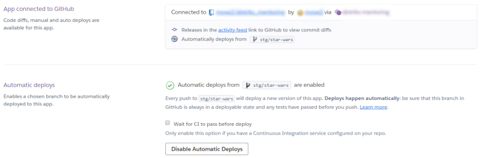
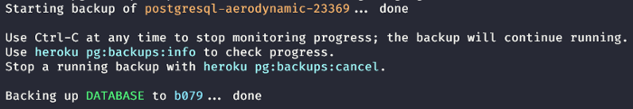

Originalmente postado no [Medium](https://medium.com/@jonyhayama/como-clonar-um-app-no-heroku-f8b7488950e3)

Hoje fui confrontado com uma task super simples: Criar 3 ambientes de _staging_ para que nossos QAs trabalharem e assim evitar que fiquem “trombando” uns nos outros. O nosso cenário até o momento era, 1 ambiente por projeto e 2 profissionais para fazer os testes.

Nosso problema surgiu quando decidimos fazer uma força-tarefa e agilizar as entregas para um cliente em específico. Todo o time será realocado para o mesmo projeto. Aliado a isso, um novo QA foi contratado para compor a equipe.

Agora ficamos: 1 projeto, 3 QAs e apenas 1 ambiente para que façam seus testes.

Com apenas um ambiente, é natural que não consigam testar coisas diferentes em paralelo. Nossa ideia foi bastante simples: Criar um ambiente de staging para cada um e compartilho como fizemos:

A ideia é copiar o app `my-staging` para `my-new-staging`. Estou partindo do pressuposto que o [Heroku Cli](https://devcenter.heroku.com/articles/heroku-cli) já está instalado e operando.

## Repositório

Aqui trabalhamos com o Automatic Deploy, vinculado a uma branch específica do GitHub (carinhosamente chamada de `stg/star-wars`).

Esse processo é bastante simples:

```bash
git checkout master
git pull
git checkout -b stg/star-wars
git push -u origin HEAD
```

Depois crie a nova aplicação no Heroku e na seção “Deploy” conecte seu GitHub e escolha a branch conforme o print abaixo:



## Copiando as variáveis de ambiente

Primeiro copiamos as variáveis para um `txt` qualquer:

```bash
heroku config -s -a my-staging > heroku-env.txt
```

Depois é necessário enviá-las para a nova aplicação. Antes disso, é importante revisar as variáveis que, de fato, precisam ir. De cara, precisamos remover `DATABASE_URL`, já que o banco de dados será outro.

```bash
cat heroku-env.txt | tr '\n' ' ' | xargs heroku config:set -a my-new-staging
```

## Copiando o banco de dados (PostgreSQL)

Primeiramente precisamos gerar o backup na app de origem:

```bash
heroku pg:backups:capture -a my-staging
```

Esse comando terá uma resposta parecida com o print abaixo:



O importante aqui é a referência `b079`, que utilizaremos no próximo comando:

```bash
heroku pg:backups:restore my-staging::b079 --app my-new-staging
```

Repeti esse processo mais duas vezes e _voilà_ card movido para “done” 😃
