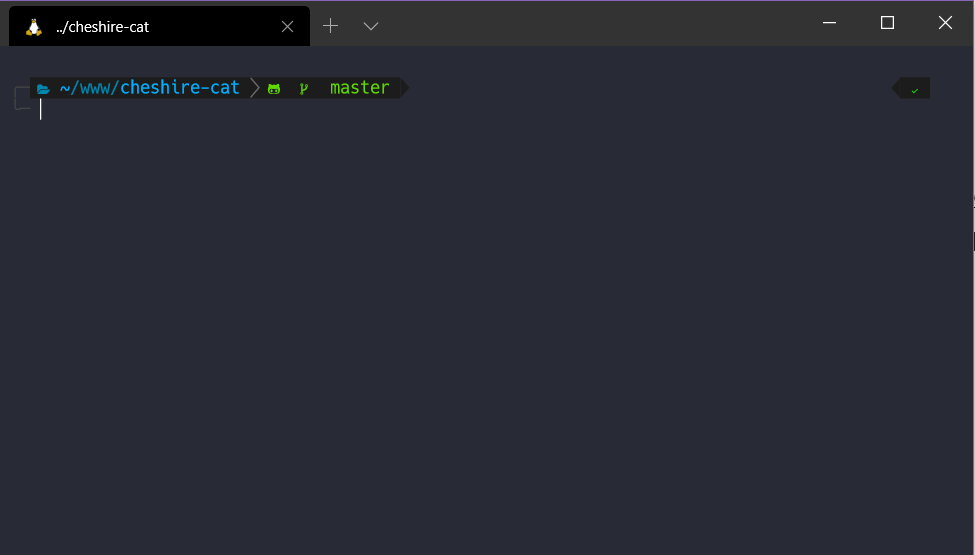

Há mais ou menos seis meses tenho utilizado o WSL2 como meu ambiente principal de desenvolvimento. Anteriormente usava a versão 1 e anteriormente o Ubuntu.

Atualmente tenho diferentes projetos criados com Ruby on Rails, React, AdonisJS, VueJS, WordPress e utilizo o VS Code como editor principal.

Esse é o primeiro post de uma série de 4:

1. [Geral](https://dev.to/jonyhayama/meu-ambiente-para-desenvolvimento-web-com-wsl2-geral-3dag)
2. [Ruby on Rails (PostgreSQL)](https://dev.to/jonyhayama/meu-ambiente-para-desenvolvimento-web-com-wsl2-ruby-on-rails-postgresql-1g8d)
3. [Javascript (AdonisJS + React + VueJS)](https://dev.to/jonyhayama/meu-ambiente-para-desenvolvimento-web-com-wsl2-javascript-adonisjs-react-vuejs-3h4a)
4. [Apache + MySQL + PHP (WordPress)](https://dev.to/jonyhayama/meu-ambiente-para-desenvolvimento-web-com-wsl2-apache-mysql-php-wordpress-23of)

Muitos usuário Linux vão torcer o nariz e dizer que seria melhor utilizar o Ubuntu diretamente ou o Mint ou Debian ou qualquer outra distro. Em linhas gerais, concordo. Meu principal problema, entretanto, é o simples fato dos aplicativos comerciais (como Photoshop, CorelDraw, Illustrator, pacote Office, etc.) não serem muito amigáveis com o pinguim.

Já usei as alterativas open source (como Gimp, Inkscape, LibreOffice, etc.), mas não consigo obrigar parceiros de trabalho a fazer o mesmo 🤷‍♂️. Já usei Wine, mas no final ficou meio "esquisito". Já usei dual boot e não suporto ter que reiniciar a máquina só por conta de uma aplicação.

Como (ainda) não tenho condições de trocar meu carro por uma maçã mordida, fico com o Windows que já veio instalado no meu notebook.

WSL não é perfeito. A versão 1 é bem lenta quando se trata de trabalho com muitos arquivos (leia-se `npm install`, `bundle install` e similares). A versão 2 trás uma melhora significativa nesse aspecto (apesar de ter seus problemas também). A Microsoft têm trabalhado bastante nessa frente e eu acredito que o resultado é excepcional. Vale lembrar, entretanto, que ainda estamos na fase de "preview", ou seja, alguns bugs são esperados.

Enfim, a ideia deste post não é justificar cada uma das minha escolhas, mas apenas compartilhá-las :)

## Instalando o WSL

Antes de mais nada é necessário habilitar o WSL no sistema. Para isso,  basta executar o comando abaixo no PowerShell:

```powershell
Enable-WindowsOptionalFeature -Online -FeatureName Microsoft-Windows-Subsystem-Linux
```

Assim que o comando terminar de executar, será solicitado que você reinicie seu PC.

Agora, vá na Microsoft Store e faça uma busca por "Ubuntu". Existem outras distros na loja, não cheguei a testá-las, mas como já estou acostumado, uso o Ubuntu mesmo. A versão que utilizo é a 18.04.


<figcaption>Pausa para assimilar a instalação de uma distro Linux dentro da Microsoft Store…</figcaption>

Clique em "Obter" e a própria Store fará a instalação. Depois de instalado, será possível acessar o ambiente do Ubuntu diretamente do menu Iniciar. Na primeira vez que você o fizer, será necessário cadastrar seu usuário senha.

Já fiz esse setup diversas vezes para diversos colegas de trabalho e até hoje não tive problemas, mas a própria Microsoft possui um Troubleshoot nesse link: <https://docs.microsoft.com/pt-br/windows/wsl/install-win10>

### Ativando a versão 2

Para usar a versão do WLS, é necessário (até o momento de escrita dessa postagem) ingressar no [Windows Insider Program](https://insider.windows.com/en-us/).

Agora, é necessário ativar o componente opcional "Plataforma de máquina virutal", o que pode ser feito executando os comandos abaixo no PowerShell e reiniciando o PC.

```powershell
dism.exe /online /enable-feature /featurename:Microsoft-Windows-Subsystem-Linux /all /norestart
dism.exe /online /enable-feature /featurename:VirtualMachinePlatform /all /norestart
```

De volta ao PowerShell, você pode verificar a versão do WSL para cada versão usando o comando `wsl -l -v`. Agora é só executar:

```powershell
wsl --set-version <Distro> 2
```

Caso precise de mais detalhes, acesse a documentação da própria Microsoft: <https://docs.microsoft.com/pt-br/windows/wsl/wsl2-install>

## Windows Terminal

Existem várias opções para usar um terminal no Windows. Uma das mais populares é o Hyper, que funciona muito bem também, mas com o [Windows Terminal](https://www.microsoft.com/pt-br/p/windows-terminal-preview/9n0dx20hk701?activetab=pivot:overviewtab) foi amor à primeira vista. Nele você consegue abrir abas de qualquer terminal que existe no Windows (Power Shell, cmd, WSL), ele aceita splits e a configuração é um simples JSON!

Então corre lá na Microsoft Store e instale-o, pode me agradecer depois ;)

### [Oh my ZSH](https://ohmyz.sh/)

Particularmente gosto de um terminal cheio de auxílios visuais. Algo nessa linha:

  

<figcaption>Terminal sexy</figcaption>

Para chegar lá, primeiro precisamos instalar o ZSH:

```bash
sudo apt install zsh
```

Agora que o ZSH está instalado, bora instalar o Oh My ZSH

```bash
sh -c "$(curl -fsSL https://raw.github.com/ohmyzsh/ohmyzsh/master/tools/install.sh)"
```

Existem diversos plugins com diversas funcionalidades que já vêm junto com a instalação, você pode ver a lista completa em <https://github.com/ohmyzsh/ohmyzsh/wiki/Plugins>

Particularmente uso dois que não estão na lista:

1 - [zsh-syntax-highlighting](https://github.com/zsh-users/zsh-syntax-highlighting) que adiciona uma cor verde ou vermelha ao digitar um comando para te ajudar a ver se está correto ou não, para instalá-lo:

```bash
git clone https://github.com/zsh-users/zsh-syntax-highlighting.git ${ZSH_CUSTOM:-~/.oh-my-zsh/custom}/plugins/zsh-syntax-highlighting
```

2 - [zsh-autosuggestions](https://github.com/zsh-users/zsh-autosuggestions) que irá exibir sugestões de comandos baseado no histórico de comandos que você já digitou, para instalá-lo:

```bash
git clone https://github.com/zsh-users/zsh-autosuggestions $ZSH_CUSTOM/plugins/zsh-autosuggestions
```

Depois de instalar os plugins será necessários adicioná-los na linha de plugins no seu `~./zshrc`, vai ficar assim:

```txt
plugins=(
 git
 zsh-syntax-highlighting
 zsh-autosuggestions
)
```

### [Powerlevel10k](https://github.com/romkatv/powerlevel10k#oh-my-zsh)

Esse será o responsável por deixar nosso terminal bonitão! Para exibir os ícones da maneira correta, primeiro precisamos instalar uma Nerd Font. Via de regra eu uso a Hack, mas se você é daqueles programadores que curte uma "ligature" sugiro a FiraCode. Baixe o pacode `zip` e instale as fontes.

Agora só é necessário ajustar a configuração do nosso terminal para exibir essa nova fonte. Já que vamos alterar esse arquivo, acredito que seja uma boa oportunidade para instalar o tema Dracula (que eu adoro).

Então abra as opções do seu terminal (`ctrl + ,`) e adicione o array abaixo, logo depois do array de `profiles`:

```json
"schemes": [
  {
    "name" : "Dracula",
    "background" : "#272935",
    "black" : "#21222C",
    "blue" : "#BD93F9",
    "cyan" : "#8BE9FD",
    "foreground" : "#F8F8F2",
    "green" : "#50FA7B",
    "purple" : "#FF79C6",
    "red" : "#FF5555",
    "white" : "#F8F8F2",
    "yellow" : "#FFB86C",
    "brightBlack" : "#6272A4",
    "brightBlue" : "#D6ACFF",
    "brightCyan" : "#A4FFFF",
    "brightGreen" : "#69FF94",
    "brightPurple" : "#FF92DF",
    "brightRed" : "#FF6E6E",
    "brightWhite" : "#F8F8F2",
    "brightYellow" : "#FFFFA5"
  }
]
```

Agora, no seu array de `profiles` altere o objeto do seu WSL acrescentando o seguinte:

```json
"fontFace": "FiraCode Nerd Font",
"colorScheme": "Dracula",
"fontSize": 10
```

Seu objeto ficará mais ou menos assim:

```json
{
    "guid": "{07b52e3e-de2c-5db4-bd2d-ba144ed6c273}",
    "hidden": false,
    "name": "Ubuntu-20.04",
    "source": "Windows.Terminal.Wsl",
    "fontFace": "FiraCode Nerd Font",
    "colorScheme": "Dracula",
    "fontSize": 10
}
```

Ainda nas opções do terminal, sugiro alterar o `defaultProfile` para o `guid` equivalente ao seu WSL, assim eles será o padrão ao abrir uma nova aba.

Finalmente é hora de instalar o Powerlevel10k, portanto execute esse comando no seu terminal:

```bash
git clone --depth=1 https://github.com/romkatv/powerlevel10k.git ${ZSH_CUSTOM:-~/.oh-my-zsh/custom}/themes/powerlevel10k
```

Agora abra seu `~/.zshrc` e altere a linha do tema para `ZSH_THEME="powerlevel10k/powerlevel10k"` e abra uma nova aba do WLS. Você será levado para um wizard para que escolha as opções que achar mais interessante.

## VS Code

Acesse o site e baixe o instalável: https://code.visualstudio.com/. A instalação segue o bom e velho modelo "next, next, next, install". Sim, a instalação é feita no Windows e não no WSL.

Para fazer com que ele funcione em conjunto com o WSL, é necessário adicionar duas extensões, aí vão:

- [Remote Development](https://marketplace.visualstudio.com/items?itemName=ms-vscode-remote.vscode-remote-extensionpack)
- [Remote - WSL](https://marketplace.visualstudio.com/items?itemName=ms-vscode-remote.remote-wsl)

Depois das extensões instaladas, basta acessar uma pasta no seu WSL e executar `code .` e o VS Code baixará um server para seu WSL e abrirá com a indicação de que você está no seu ambiente Ubuntu. 

Como já disse, adoro o tema Drácula, e alguns auxílios visuais, portanto vou deixar aqui uma pequena lista das extensões que uso no meu dia-a-dia bem como algumas configurações que utilizo no meu editor.

**Extensões:**

- [Bracket Pair Colorizer](https://marketplace.visualstudio.com/items?itemName=CoenraadS.bracket-pair-colorizer)
- [Dracula Official](https://marketplace.visualstudio.com/items?itemName=dracula-theme.theme-dracula)
- [Highlight Matching Tag](https://marketplace.visualstudio.com/items?itemName=vincaslt.highlight-matching-tag)
- [Material Icon Theme](https://marketplace.visualstudio.com/items?itemName=PKief.material-icon-theme)
- [GitLens](https://marketplace.visualstudio.com/items?itemName=eamodio.gitlens) (não só pelos auxílios visuais, mas adoro o current line blame 😂)

**settings.json**:

```json
"editor.tabSize": 2,
"highlight-matching-tag.styles": {
  "opening": {
    "full": {
      "custom": {
        "dark": {
          "backgroundColor": "rgba(255, 255, 255, .15)",
          "borderWidth": "1px 0 1px 0",
          "borderColor": "rgb(80, 250, 123)",
          "borderStyle": "solid",
          "right": "10px"
        },
        "light": {
          "backgroundColor": "rgba(0, 0, 0, .15)",
          "borderWidth": "1px 0 1px 0",
          "borderColor": "brown",
          "borderStyle": "solid",
          "right": "10px"
        }
      }
    }
  },
  "closing": {
    "full": {
      "custom": {
        "dark": {
          "backgroundColor": "rgba(255, 255, 255, .15)",
          "borderWidth": "1px 0 1px 0",
          "borderColor": "rgb(80, 250, 123)",
          "borderStyle": "solid",
          "right": "10px"
        },
        "light": {
          "backgroundColor": "rgba(0, 0, 0, .15)",
          "borderWidth": "1px 0 1px 0",
          "borderColor": "brown",
          "borderStyle": "solid",
          "right": "10px"
        }
      }
    }
  }
},
"files.autoSave": "off",
"editor.fontFamily": "'FiraCode Nerd Font', Consolas, 'Courier New', monospace",
"editor.fontLigatures": "'ss01', 'ss02', 'ss03', 'ss05'"
```

Acredito que essas configurações sejam bem genéricas e se aplicam a qualquer linguagem que você resolva utilizar para desenvolver. Como disse no começo dessa postagem, eu utilizo stacks diferentes dependendo do projeto em que vou trabalhar. Nas próximas postagens vou compartilhar stack por stack, acompanhe! 😊

Também publicado no [Medium](https://medium.com/@jonyhayama/meu-ambiente-para-desenvolvimento-web-com-wsl2-geral-4a206b3194be)
