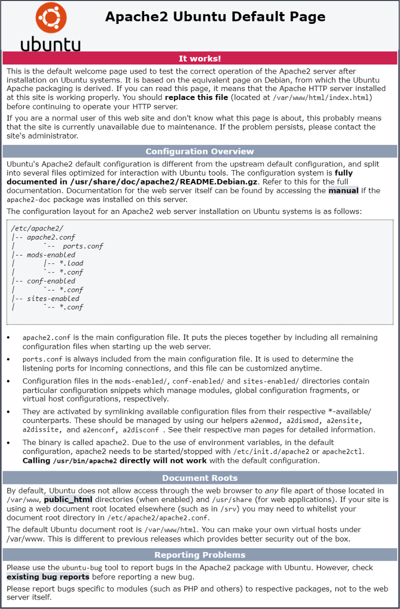

Esse post é o último de uma série de 4

1. [Geral](https://dev.to/jonyhayama/meu-ambiente-para-desenvolvimento-web-com-wsl2-geral-3dag)
2. [Ruby on Rails (PostgreSQL)](https://dev.to/jonyhayama/meu-ambiente-para-desenvolvimento-web-com-wsl2-ruby-on-rails-postgresql-1g8d)
3. [Javascript (AdonisJS + React + VueJS)](https://dev.to/jonyhayama/meu-ambiente-para-desenvolvimento-web-com-wsl2-javascript-adonisjs-react-vuejs-3h4a)
4. [Apache + MySQL + PHP (WordPress)](https://dev.to/jonyhayama/meu-ambiente-para-desenvolvimento-web-com-wsl2-apache-mysql-php-wordpress-23of)

### Importante

Quero reforçar que essa instalação é para um ambiente de **DESENVOLVIMENTO**. Há diversas configurações de segurança que precisam ser feitas para um servidor de produção!

### Apache

Primeiramente vamos instalar o Apache. Para um ambiente PHP, há muitas pessoas que utilizam Nginx ou simplesmente o `php -S`. Minha escolha pelo apache se dá por um motivo bastante simples: Tenho uma revenda de hospedagem com cPanel que utiliza essa tecnologia. Como coloco a vasta maioria dos meus clientes lá, prefiro que meu ambiente de desenvolvimento reflita (pelo menos em partes) o ambiente que terei por lá.

Então bora:

```bash
sudo apt update  
sudo apt install apache2
```

Para iniciar nosso servidor, basta utilizar:

```bash
sudo service apache2 start
```

Acesse `http://localhost` no seu navegador e verá a página padrão do apache2:



### MySQL

Como já está disponível no `apt`, basta executar:

```bash
sudo apt install mysql-server
```

Assim como na instalação do PostgreSQL, tenho o costume de criar um usuário para mim e não ficar utilizando o _root_ para tudo, portanto, vamos lá, acesse o _mysql_ com o comando abaixo:

```bash
sudo mysql -u root
```

Segue o comando para criar seu usuário:

```sql
CREATE USER 'meu-nome-de-usuario'@'localhost' IDENTIFIED BY 'MinhaSenhaSecreta'; FLUSH PRIVILEGES;
```

Agora que ele está criado, precisamos dar permissão para que ele acesse todos os bancos:

```sql
GRANT ALL PRIVILEGES ON *.* TO 'meu-nome-de-usuario'@'localhost'; FLUSH PRIVILEGES;
```

Por fim, precisamos adicionar a permissão de conceder permissões para o nosso usuário:

```sql
GRANT GRANT OPTION ON *.* TO 'meu-nome-de-usuario'@'localhost'; FLUSH PRIVILEGES;
```

### PHP

A inslação do PHP em si é a mais direta possível:

```bash
sudo apt install php libapache2-mod-php php-mysql
```

### Configurações adicionais

Nem todas as configurações abaixo são necessárias para todos, por isso listá-las separadamente. A maioria delas exige que você reinicie o apache para que tenham efeito, portanto já vou deixar o comando aqui 😉

```bash
sudo service apache2 restart
```

#### PHPMyAdmin

Há diversas formas de gerenciar seu banco de dados MySQL. Particularmente utilizo o PHPMyAdmin pelo mesmo motivo que uso o Apache: Para refletir meu ambiente de produção.

Há quem prefira baixar os arquivos diretamente do [site oficial](https://www.phpmyadmin.net/) e fazer as configurações manualmente. Pessoalmente prefiro instalá-lo pelo `apt`:

```bash
sudo apt update
sudo apt install phpmyadmin php-mbstring
sudo phpenmod mbstring
```

Agora precisamos adicionar as configurações que já vêm prontinhas ao apache, para isso vamos editar o arquivo:

```bash
sudo vim /etc/apache2/apache2.conf
```

Basta adicionar essa linha ao final:

```txt
Include /etc/phpmyadmin/apache.conf
```

Reinicie o apache e acesse `http://localhost/phpmyadmin` para ver se tudo está funcionando :)

#### ModRewrite

Como o WordPress utiliza o `mod_rewrite` para criar suas URL amigáveis, é necessário ativá-lo:

```bash
sudo a2enmod rewrite
```

#### Alterando a pasta padrão do Apache

Pode ser frescura, mas prefiro ter meus projetos na pasta `~/www`, “sue me”.

Para que o apache considere essa pasta como o padrão para `localhost`, precisamos editar o arquivo `000-default.conf`. Particularmente estou usando o `vim` como editor, mas você pode fazer com o editor de sua preferência:

```bash
sudo vim /etc/apache2/sites-enabled/000-default.conf
```

Nesse arquivo, precisamos colocar o endereço completo de onde estão nossos arquivos. O atalho `~` não funciona. Normalmente o endereço é `/home/meu-usuario/www`. No meu caso, a pasta é `/home/jony/www`. Se você não tem certeza de qual é o endereço da pasta que deseja, basta acessá-la e utilizar o comando `pwd`.

Agora que já sabemos o endereço que vamos utilizar, altere a linha do `DocumentRoot` para o novo endereço e adicione o bloco abaixo no final do arquivo, lembre-se de substituir o meu endereço pelo seu 😉:

```txt
<Directory "/home/jony/www">  
  Order allow,deny  
  Allow from all  
  Options Indexes FollowSymLinks MultiViews  
  AllowOverride All  
  Require all granted  
</Directory>
```

#### Permissão de arquivos

Para que o apache consiga editar seus arquivos, você precisa que seus arquivos pertençam ao grupo `www-data`, o problema é que nosso usuário não pertence a esse grupo, ou seja, se simplesmente trocarmos o grupo, nós perderíamos a possibilidade de editar nosso arquivos…

Portanto, vamos adicionar nosso usuário ao grupo:

```bash
sudo adduser $USER www-data
```

Como eu compartilho a pasta `~/www` entre vários projetos (nem todos PHP) prefiro adicionar permissões, projeto-a-projeto, portanto, toda vez que inicio um projeto php, rodo os seguintes comandos:

```bash
sudo chown -R $USER:www-data /home/jony/www/novo-projeto  
cd ~/www/novo-projeto
sudo find . -type f -exec chmod 664 {} + ;  
sudo find . -type d -exec chmod 775 {} + ;
```

#### Permitindo arquivos maiores

Por padrão, o tamanho máximo de upload de arquivos do apache é 2MB, que é bem pouco, portanto, vamos aumentá-lo. 

Para isso, vamos editar o arquivo:

```bash
sudo vim /etc/php/7.4/apache2/php.ini
```

Precisamos ajustar as duas configurações abaixo. Estou colocando 100M (representando 100 megabytes), mas você pode colocar outro valor que preferir.

Infelizmente essas informações não estão perto uma da outra e o arquivo também é bem grande, portanto é necessário procurá-las.

```
post_max_size = 100M  
upload_max_filesize = 100M
```

**Dica:** Para fazer uma busca pelo `vim` , basta digitar `/texto-procurado` 😉

Depois de alteradas, salve o arquivo e reinicie o apache.

#### SSL

Muitas vezes instalo plugins no WordPress para fazer o redirecionamento para a versão com SSL do site. Em produção, com um servidor — de fato — certificado, funciona que é uma beleza, mas quando copio os arquivos para meu servidor local, fico trancado para fora do `/wp-admin` 🤦‍♂️. Para facilitar a vida e não ter que ficar navegando no banco ou desativando o plugin toda vez que isso acontece, prefiro configurar um certificado auto-assinado localmente. Ainda vejo a mensagem de “site não seguro”, mas isso não é um problema, já que essa mensagem só aparece para mim :)

Primeiro vamos habilitar o módulo no apache:

```bash
sudo a2enmod ssl
```

Reinicie seu apache e vamos criar o seguinte diretório:

```bash
sudo mkdir /etc/apache2/ssl
```

Agora, vamos criar o certificado em si:

```bash
sudo openssl req -x509 -nodes -days 365 -newkey rsa:2048 -keyout /etc/apache2/ssl/apache.key -out /etc/apache2/ssl/apache.crt
```

Você precisará responder algumas perguntas para que o certificado seja gerado. Abaixo, deixei as respostas que utilizei:

```txt
Country Name (2 letter code) [AU]:BR  
State or Province Name (full name) [Some-State]:Minas Gerais  
Locality Name (eg, city) []:Varginha  
Organization Name (eg, company) [Internet Widgits Pty Ltd]:Jony Hayama  
Organizational Unit Name (eg, section) []:<vazio>  
Common Name (e.g. server FQDN or YOUR name) []:localhost  
Email Address []:localhost@localhost
```

Agora precisamos configurar nosso apache para utilizar o certificado que criamos na pasta que desejamos, portanto vamos editar o arquivo:

```bash
sudo vim /etc/apache2/sites-available/default-ssl.conf
```

Excluindo os comentários, esse arquivo vem com o conteúdo abaixo:

```txt
<IfModule mod_ssl.c>
 <VirtualHost _default_:443>
  ServerAdmin webmaster@localhost
  DocumentRoot /var/www/html
  ErrorLog ${APACHE_LOG_DIR}/error.log
  CustomLog ${APACHE_LOG_DIR}/access.log combined
  SSLEngine on
  SSLCertificateFile /etc/ssl/certs/ssl-cert-snakeoil.pem
  SSLCertificateKeyFile /etc/ssl/private/ssl-cert-snakeoil.key
  <FilesMatch "\.(cgi|shtml|phtml|php)$">
    SSLOptions +StdEnvVars
  </FilesMatch>
  <Directory /usr/lib/cgi-bin>
    SSLOptions +StdEnvVars
  </Directory>
 </VirtualHost>
</IfModule>
```

O arquivo finalizado ficará assim:

```txt
<IfModule mod_ssl.c>
 <VirtualHost _default_:443>
  ServerAdmin webmaster@localhost
  ServerName localhost
  DocumentRoot /home/jony/www
  ErrorLog ${APACHE_LOG_DIR}/error.log
  CustomLog ${APACHE_LOG_DIR}/access.log combined
  SSLEngine on
  SSLCertificateFile /etc/apache2/ssl/apache.crt
  SSLCertificateKeyFile /etc/apache2/ssl/apache.key
  <FilesMatch "\.(cgi|shtml|phtml|php)$">
    SSLOptions +StdEnvVars
  </FilesMatch>
  <Directory /home/jony/www>
    SSLOptions +StdEnvVars
    DirectoryIndex index.php
    AllowOverride All
    Order allow,deny
    Allow from all
  </Directory>
  BrowserMatch "MSIE [2-6]" \
          nokeepalive ssl-unclean-shutdown \
          downgrade-1.0 force-response-1.0
  BrowserMatch "MSIE [17-9]" ssl-unclean-shutdown
 </VirtualHost>
</IfModule>
```

Destaquei o endereço pois eu não utilizo o endereço padrão do apache que é `/var/www/html`.

Por fim, é necessário habilitar as configurações do arquivo:

```bash
sudo a2ensite default-ssl.conf
```

Prontinho, basta reiniciar seu apache e você poderá acessar `http**s**://localhost` .

### WordPress

Instalar o WordPress também é simples e direto, então bora lá:

```bash
wget https://wordpress.org/latest.tar.gz; tar -vzxf latest.tar.gz; mv wordpress **nova-pasta**;
```

Lembre-se de ajustar as permissões de arquivo conforme descrito mais acima.

Agora basta acessar `http://localhost/**nova-pasta**` e seguir os passos de instalação do próprio WP.

### Conclusão

Este ambiente não é perfeito, mas têm me atendido bem. Em linhas gerais gostaria que o WSL tivesse um pouco mais de performance, mas nada que atrapalhe o dia-a-dia.

Basicamente acredito que o WSL é um ótimo meio termo entre Linux direto e um Mac. Se você, como eu, precisa de diversos aplicativos comerciais que não estão disponíveis para o pinguim e não tem grana suficiente para comprar uma maçã, acredito que esse ambiente é para você :)

Essa foi a minha primeira série de posts publicada no Medium, espero que tenha gostado!
